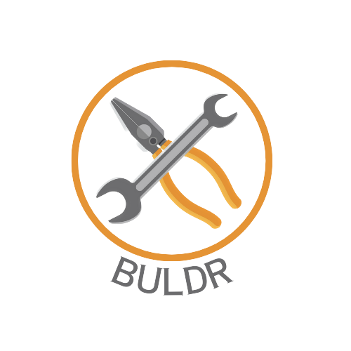

#  Buldr-Bangladesh

Buldr-Bangladesh is a full-stack project designed as a multi-purpose platform tailored to engineers for showcasing their skills. The platform integrates various tools for learning, showcasing, monetizing, and job opportunities.

## Technologies Used

- **Frontend**:
  - **React.js**: A JavaScript library for building user interfaces.
  - **Tailwind CSS**: A utility-first CSS framework for rapid UI development.
  - **Flowbite**: A component library built on top of Tailwind CSS.
  - **Material-UI**: A popular React UI framework for building responsive and modern web applications.
  - **Firebase**: A platform for building web and mobile applications, used here for authentication and real-time database.

- **Backend**:
  - **Java**: The primary programming language used for the backend development.
  - **Spring Boot**: A framework for building production-ready applications with Java, providing features like dependency injection, web MVC, and more.
  - **PostgreSQL**: A powerful, open-source relational database system used for storing application data.
  - **JWT (JSON Web Tokens)**: Used for secure authentication and authorization.
  - **Maven**: A build automation tool used for managing project dependencies and building the application.
  - **Swagger**: A tool for documenting and testing RESTful APIs.

## Features

### Learning

- **AI Chatbot**: Provides interactive learning assistance.
- **Smart Notes Application**: Allows users to create, view, edit, and manage notes.
- **AI Tools**: Includes features for summarizing and paraphrasing text.

### Showcasing

- **Post Creation**: Enables users to create posts with an advanced UI.
- **Public Project Showcases**: Allows users to showcase their projects for visibility.

### Monetizing

- **Marketplace**: Provides a platform for users to sell their projects.
- **Order Management**: Manages transactions with order tracking and status updates.

### Jobs

- **Auto-generated Portfolios**: Generates portfolios based on user projects.
- **Integrated Public Notes**: Displays notes as blogs in user portfolios.

To get started with the project, follow the instructions in the [Buldr-Frontend](https://github.com/BuldrBangladesh/Buldr-Frontend.git), [Buldr-Backend](https://github.com/BuldrBangladesh/Buldr-Backend.git) and [Buldr-Marketplace-Frontend](https://github.com/BuldrBangladesh/Buldr-Marketplace-Frontend.git) directories.
